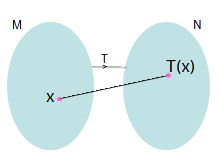
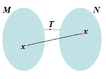
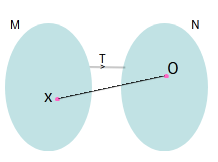

This experiment helps students understand what a linear transformation is and how it is related to matrices. The experiment shows that every linear transformation can be written using a matrix and vice-versa, which makes it easier to work with. By doing this, students learn how matrices can be used to represent transformations and apply these in various contexts in a simple and clear way.
#### 1. Linear transformation:
Let <i>M</i> and <i>N</i> be vector spaces over a field <i>R</i>. Then a function <i>T</i>:<i>M→N</i> is called a linear transformation if, for<i>x, y</i>&isin;<i>M</i> and <i>α</i>&isin;<i>R</i>  
(i) <i>T</i>(<i>x</i>+<i>y</i>)=<i>T</i>(<i>x</i>)+<i>T</i>(<i>y</i>)  
(ii) <i>T</i>(<i>αx</i>)=<i>αT</i>(<i>x</i>)

 
##### 1.1. Identity transformation:
Let <i>M</i> be a vector space over a field <i>R</i>. Then the function <i>T</i>:<i>M→M</i> defined as <i>T</i>(<i>x</i>)=<i>x</i>, where <i>x</i>&isin;<i>M</i>, is linear and is known as identity transformation.

 
##### 1.2. Zero transformation:
Let <i>M</i> and <i>N</i> be vector spaces over a field <i>R</i>. Then the function <i>T</i>:<i>M→N</i> defined as <i>T(<i>x</i>)=0, where <i>x</i>&isin;<i>M</i>, is linear and is known as zero transformation.

 
##### 1.3. Examples:
a). Let <i>T</i>:<i>R^{2}→R^{2}$ such that $T(x, y)=(x, -y)$, where $x, y \in R$. Then $T$ is linear.

#### Proof:
Let $x=(x_{1}, x_{2})$ and $y=(y_{1}, y_{2}) \in R^{2}.$ Then $T(x_{1}, x_{2})=(x_{1}, -x_{2})$ and
$T(y_{1}, y_{2})=(y_{1}, -y_{2})$. Notice that 
(i) $T(x+y)=T[(x_{1}, x_{2}>)+(y_{1}, y_{2})]=T(x_{1}+y_{1}, x_{2}+y_{2})=(x_{1}+y_{1}, -(x_{2}+y_{2}))$ and $T(x)+T(y)=(x_{1}, -x_{2})+ (y_{1}, -y_{2})= (x_{1}+y_{1}, -(x_{2}+y_{2})).$  
(ii) $T(αx)=T(αx_{1}, αx_{2})=(αx_{1}, -αx_{2})$ and
$αT(x)=α(x_{1}, -x_{2})=(αx_{1}, -αx_{2}).$  

b). Let $T:R^{2}$ &rarr; $R^{2}$ such that $T(x, y)=(x, 0),$ where $x, y \in R.$ Then $T$ is linear.  
#### Proof:
Let $x=(x_{1}, x_{2})$ and $y=(y_{1}, y_{2}) \in R^{2}$. Then $T(x_{1}, x_{2})=(x_{1}, -x_{2})$ and $T(y_{1}, y_{2})=(y_{1}, -y_{2}).$ Notice that 
(i) $T(x+y)=T[(x_{1}, x_{2})+(y_{1}, y_{2})]=T(x_{1}+y_{1}, x_{2}+y_{2})=(x_{1}+y_{1}, 0)$ and $T(x)+T(y)=(x_{1}, 0)+ (y_{1}, 0)=(x_{1}+y_{1}, 0).$  
(ii) $T(αx)=T(αx_{1}, αx_{2})=(αx_{1}, 0)$ and
$αT(x)=α(x_{1}, 0)=(αx_{1}, 0).$  

c). Let $T:R^{2}$ &rarr; $R^{2}$ such that $T(x, y)=(x, 0),$ where $x, y \in R.$ Then $T$ is linear.  
#### Proof:
Let $x=(x_{1}, x_{2})$ and $y=(y_{1}, y_{2}) \in R^{2}$. Then $T(x_{1}, x_{2})=(x_{1}, -x_{2})$ and $T(y_{1}, y_{2})=(y_{1}, -y_{2}).$ Notice that 
(i) $T(x+y)=T[(x_{1}, x_{2})+(y_{1}, y_{2})]=T(x_{1}+y_{1}, x_{2}+y_{2})=( x_{2}+y_{2}, x_{1}+y_{1})$ and
$T(x)+T(y)=(-x_{2}, x_{1})+ (-y_{2}, y_{1})= ( x_{2}+y_{2}, x_{1}+y_{1}).$  
(ii) $T(αx)=T(αx_{1}, αx_{2})=(αx_{1}, -αx_{2})$ and
$αT(x)=α(x_{2}, x_{1})=(αx_{1}, -αx_{2}).$

##### 1.4. Proposition:
   Let $T:M→N$ be a linear transformation. Then  
   (i) $T(0)=0;$ where 0 on the L.H.S is the zero vector of $M$ and 0 on the R.H.S is the zero vector of  $N.$  
   (ii) $T(-x)=-T(x),$ for all $x \in M$  
   (iii) $T(x-y)=T(x)-T(y),$ for all $x, y \in M$ 
   (iv) $T(αx+βy)=αT(x)+βT(y),$ for all $x, y \in M$ and    $α, β \in R$ 

##### 1.5. Proposition:
Let $T:V→W$ be a linear map and $V$ and $W$ be finite dimensional vector spaces over $R$ and  
$ B= \{e_{1}, e_{2}, …, e_{n}\} $ is a basis for $V$ and let $x= r_{1}f_{1}+r_{2} e_{2}+ ... +r_{n}e_{n},$ where $x \in V, r_{1}, r_{2}, …, r_{2} \in R.$ Then $T(e_{1}), T(e_{2}), …, T(e_{n})$ define $T,$ by  $T(x)= rT(e_{1})+sT(e_{2})+  … +tT(e_{n}).$

#### 2. Matrix associated with a linear transformation:
Let T:R3→R2 be a linear transformation. Let B1={f1, f2, f3} and B2={e1, e2} be basis of R3 and R2 respectively. Then T(f1)=ae1+be2, T(f2)=ce1+de2 and T(f3)=ge1+he2, for some a, b, c, d, g, h&isin;R.

Let A=

$$\begin{pmatrix}a & c & e \\\ b & d & f\end{pmatrix}$$

Then matrix A is of order 2×3 and is called the matrix representation of T w.r.t. the basis B1 and B2. 
In a similar way, one can check that a matrix representation of T:Rn→Rm is of order m×n.

##### 2.1. Example:
Let T:R2→R2 be a linear map defined as T(x, y)=(x, -y), where x, y&isin;R. Then find the matrix associated with the transformation w.r.t. the basis B1={(1, 0), (0,1)}and B2={(0, -1), (-1, 0)}. 
Let e1=(1, 0), e2=(0, 1), f1=(0, -1) and f2=(-1, 0). Thus  
T(1, 0)=(1, 0)=0.(0, -1)+(-1).(-1, 0)
T(0, 1)=(0, -1)= 1.(0, -1)+0.(-1, 0) and hence the matrix
representation of T w.r.t. the basis B1 and B2 is

#### 3. Linear transformation associated with a matrix:
Let A=

$$\begin{pmatrix}a & c & e \\\ b & d & f\end{pmatrix}$$

be a matrix of order 2×3. Then the linear transformation T:R3→R2 associated with the matrix w.r.t. the basis B1=>={f1, f2, f3} and B2= B2={e1, e2} of R3  and R2respectively can be obtained as follows: 
Define T(f1)=ae1+be2, T(f2)=ce1+de2 and T(f3)=ge1+he2, where a, b, c, d, g, h&isin;R. Then for x&isin;V, there exist r, s, t&isin;R such that x=rf1+sf2+tf3. Thus define T(x)= rT(f1)+sT(f2)+tT(f3), because T has to be linear.

##### 3.1. Example:  
Consider A= $ \begin{pmatrix}1 & -1 & 0 \\\ 0 & 1 & 1\end{pmatrix} $

Then find the associated linear transformation of A w.r.t. the basis B1={(1, 0, 0), (-1, 1, 0), (0, 1, 1)} and B2={(-1, 1), (0, 1)} of R3 and R2 respectively.   
Define T(1, 0, 0)=1(-1, 1)+0(0, 1)=(-1, 1), T(-1, 1, 0)=-1(-1, 1)+1(0, 1)=(1, 0) and T(0, 1, 1)=0(-1, 1)+1(0, 1)=(0, 1). Since (x, y, z)=a(1, 0, 0)+b(-1, 1, 0)+c(0, 1, 1), hence a-b=x, b+c=y and c=z. By solving these equations we get, a=x+y-z, b=y-z and c=z. 
Now, define  T:R3→R2 by T(x, y, z)= aT(1, 0, 0)+bT(-1, 1, 0)+cT(0, 1, 1)=a(-1, 1)+b(1, 0)+c(0, 1)=(-a+b, a+c)=(-x, x+y), where x, y&isin;R. 
The linear transformation T:R3→R2 associated with the matrix 2×3 A w.r.t. the basis B1 and B2 is T(x, y, z)=( -x, x+y), where x, y&isin;R.
